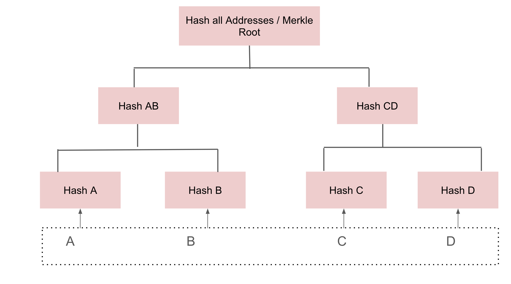
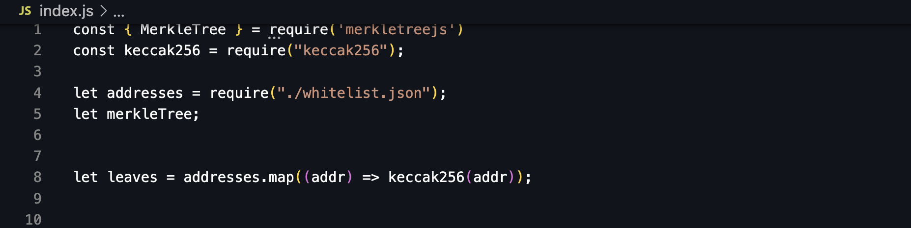
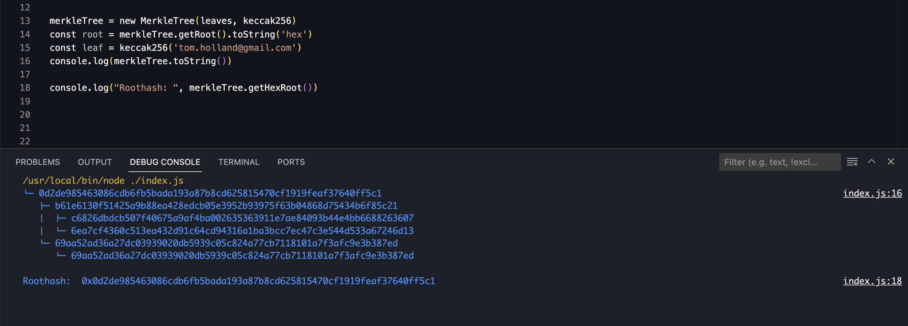
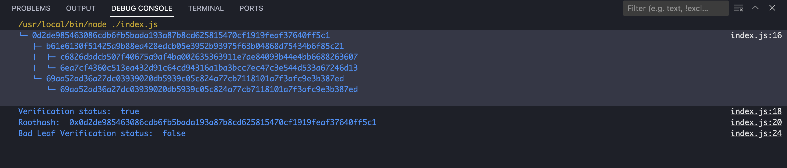

# **Understanding Merkle Proofs**

## **Introduction: Why Merkle Proofs?**

In the realm of blockchain and decentralized systems, ensuring the integrity of data is paramount. Ever wished you could prove a single puzzle piece fits without showing the whole picture? Merkle Proofs provide an elegant solution to this challenge by offering a way to efficiently prove the inclusion of a specific piece of data within a larger dataset without needing to reveal the entire dataset. But before delving into Merkle Proofs, let's first grasp the concept of Merkle Trees.

## **Merkle Trees: Building Blocks of Integrity**

Imagine a tree where each leaf represents a piece of data, and each branch node represents the cryptographic hash of its children. This is the essence of a Merkle Tree. By recursively hashing pairs of nodes until a single root hash is produced, a Merkle Tree condenses a large dataset into a single digest, making it efficient to verify the integrity of the entire dataset with just one hash. 

### Conceptual overview of Merkle Tree
Merkle Trees are a tree-like structure where every node on the tree is represented by a value that is the result of some **cryptographic hash function**. Hash functions are 1-way, meaning it is easy to produce an output from an input, but computationally infeasible to determine an input from an output. Merkle Trees feature 3 types of nodes:

1. **Leaf Nodes** — These nodes sit at the very bottom of the tree and their value is the result of the **original data** being hashed according to a specified hash function. There are as many leaf nodes in a tree for as many pieces of original data that require hashing. **E.g. If 7 pieces of data need to be hashed, there will be 7 leaf nodes.**

2. **Parent Nodes** — Parent nodes in a Merkle Tree are like managers overseeing a team of data nodes. They always sit above the leaf nodes, which represent individual pieces of data. Each parent node can have one or two child nodes beneath it. The parent node's value is determined by hashing the combined hashes of its child nodes. The order of combining these hashes matters because different inputs result in different hashes. Additionally, depending on the size of the tree, parent nodes can also foster other parent nodes, organizing the data hierarchy efficiently.

3. **Root Node** — The root node sits at the top of the tree and is derived from the hash of the concatenated hashes of the two parent nodes that sit below it, again starting from left-to-right. There is only ever a single root node on any Merkle Tree and the root node possess the root hash.

)

### So, why the hype about Merkle Proofs? 
Well, imagine you're Sherlock Holmes trying to prove a tiny clue exists in a massive case file without flipping through every page. Merkle Proofs hand you a shortcut – a trail of breadcrumbs leading from your clue to the case file's seal of approval. With this breadcrumb trail, anyone can confirm your clue's existence without sifting through the entire mystery.

## **Understanding Merkle Proofs: An analogy**

Think of the Merkle Tree as a library catalog, where each book (data) has a unique identifier (leaf node), and each shelf (branch node) represents a range of books. Now, if someone claims a specific book is in the library, instead of searching through every shelf, you can ask for a path of clues (Merkle Proof) leading from the book's identifier to the catalog's index (root hash). With this path, you can efficiently confirm the book's presence without browsing the entire library.

## **How Merkle Proofs Work**

Now, let's say you want to prove that a specific piece of data exists within this Merkle Tree without revealing the entire dataset. Here's where Merkle Proofs come into play:

1. **Start with the Leaf**: Begin by providing the leaf node (containing the desired data) and its immediate sibling node.
2. **Work Up the Tree**: Next, provide the hash of these nodes, known as a "sibling hash." Continue this process until you reach the root hash.
3. **Verify Inclusion**: With this chain of sibling hashes and the root hash, anyone can independently verify that the provided leaf is indeed a part of the Merkle Tree.


## **Real-World Applications**

Merkle Proofs find applications in various fields:

1. **Blockchain Transactions**: In blockchain networks like Bitcoin and Ethereum, Merkle Proofs enable lightweight clients to verify transactions without downloading the entire blockchain.
2. **Data Synchronization**: In distributed systems, Merkle Trees facilitate efficient data synchronization by identifying differences between datasets.
3. **Cryptographic Verification**: Merkle Proofs are integral to cryptographic systems for ensuring the integrity of data in a transparent and efficient manner.

## **Example: Email Address Whitelisting**
Merkle Trees have long been a facet in the fields of both cryptography and computer science well before the blockchain we know today ever existed. Nowadays, we are slowly starting to see them become more frequently used on-chain for the purpose of data verification. Let's say we have 4 IDS: Email Address A, B, C, and D. Each of these email addresses is going to get hashed. Let's call those hashes Hash A, B, C, and D respectively.

The following would be the resulting Merkle Tree of these transactions:


Merkle Trees must be pre-calculated and therefore use some form of data that is distinct per member. In this context, lets say a single leaf node represents a single email address in our whitelist. Lets assume that we have implemented a whitelist strategy where an arbitrary number of rewards have been reserved for select email addresses that may have been chosen through means of a competition, raffle, or some other system. These whitelisted addresses have been granted the ability to claim their rewards at some point in time. Since these addresses are known and are constant, we can use this information to create a Merkle Tree. To demonstrate this, will utilize [merkletreejs](https://www.npmjs.com/package/merkletreejs) and [keccak256](https://www.npmjs.com/package/keccak256) JavaScript libraries.

## **Implementation**
The first thing we want to do is to derive our leaf nodes. Each parent node that sits directly above leaf nodes on a tree will only ever foster a maximum of two leaf nodes. If an uneven number of leaf nodes exist, a parent node will foster a single leaf node. Each leaf node should be some form of hashed data, so for this example, lets use the keccak256 library to hash all of the addresses on our whitelist.


Once we have hashed all of the addresses on our whitelist, thus obtaining our leaf nodes, we can now create the Merkle Tree object. We'll be using the merkletreejs library and by calling the new MerkleTree() function, passing our leaf nodes as the first argument, our hashing algorithm as the second, and the { sortPairs: true } option as the last. Setting it to true allows the proof to be more succinct.


### Verification of Presence in Merkle Trees
Instead of checking every leaf node in the Merkle Tree, we utilize a Merkle Proof to verify the inclusion of specific data. This proof offers a concise way to demonstrate that the data exists within the tree without needing to reveal the entire dataset.

In the diagram above, let's think about what info must be given to the Verifier that will positively prove to the Verifier that B is part of the Merkle Tree.
- Value of B itself (so Verifier can compute Hash(B) on its own)
- H(A), so the verifier can compute Hash(AB)
- H(CD) so the verifier can compute Hash(ABCD)
  
It's important to note that only one given combination of nodes can generate this unique root Hash(ABCD) because the Merkle tree is a collision-resistant hash function which means it is a hash function that given two inputs is almost impossible to produce the same output. At this point, if the computed value of Hash(ABCD) matches the previously known value of the root hash that the Verifier had, it must be true that **B** existed in the Merkle Tree, or else the hashes wouldn't be the same.

### Running the project
- Navigate to the **src** directory.
- Run the following command ``` npm install ```.
- You can add Email addresses of your choice in the whitelist.json file. (Currently it has 3 email addresses).
- The main code for derive the leaf nodes and building the merkle tree is in the index.js file. You can simply run this .js file and see the output of the tree being built and the proof being generated given the leaf provided.



In essence, Merkle Proofs leverage the power of cryptographic hashing and binary tree structures to provide succinct and verifiable proofs of data inclusion. By enabling efficient integrity checks without revealing sensitive information, Merkle Proofs play a vital role in enhancing the security and scalability of decentralized systems.
